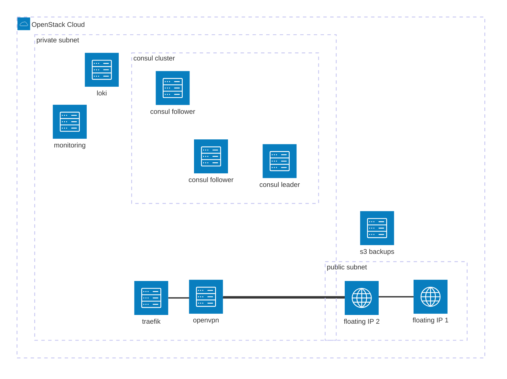

# diy-pcp-infra

This repository contains the code I use to follow the excellent Xavki learning series "[Infrastructure cloud de A à Z](https://www.youtube.com/playlist?list=PLn6POgpklwWpehxly1wOT6eB2NvZX9A-X)".

## Dependencies

- [terraform](https://github.com/hashicorp/terraform) for provisioning and managing cloud resources
- [ansible](https://github.com/ansible/ansible) for instance configurations
- [openstack cli](https://github.com/openstack/python-openstackclient) CLI client to interact with OpenStack
- ansible collections: install using `mise run ansible-install`
- Python > 3.11 required for Ansible and OpenStack CLI

### (optional) Dependencies

This section covers dependencies related to developer experience that are not required to deploy the infrastructure.

- [mise](https://github.com/jdx/mise) manages stuff like runtimes, project tasks easily, acts as a replacement for Makefile here [./mise.toml](./mise.toml)
- [ansible-lint](https://github.com/ansible/ansible-lint) Ansible linter
- [tflint](https://github.com/terraform-linters/tflint) Terraform linter
- [pre-commit](https://github.com/pre-commit/pre-commit) pre-commit hooks, used to trigger Checkov and Gitleaks
- [checkov](https://github.com/bridgecrewio/checkov) static code analysis tool for infrastructure-as-code, Terraform here
- [gitleaks](https://github.com/gitleaks/gitleaks) tool for detecting secrets before committing

## Infrastructure Overview

Infrastructure can be accessed from the internet from the OpenVPN instance with an OpenVPN-compatible client or from Traefik using an exposed web service.

## Provisioning with Terraform

Infrastructure provisioning is done using Terraform with the OpenStack provider. It can be deployed on an OpenStack-compatible infrastructure.

Three different infrastructure units can be deployed:

## VPN

[./terraform/vpn](./terraform/vpn) is the first infrastructure unit. It contains the VPN instance and the public IP to connect to the VPN.

Once deployed, you can connect to the instance using an OpenVPN client and the public floating IP with the certificate generated by [./ansible/roles/openvpn_client](./ansible/roles/openvpn_client).

To perform, initialize the Terraform backend with (`mise run tf-vpn-init`), then you can use the `terraform` CLI in the [./terraform/vpn](./terraform/vpn) folder. Ensure you have `tfvars` and Ansible environment set up before executing. Associated Ansible is run by Terraform `null_resource` that executes shell scripts.

## Infra

[./terraform/infra](./terraform/infra) is used to deploy all other resources. **Requires VPN and backup to be provisioned**.

To perform, initialize the Terraform backend with (`mise run tf-infra-init`), then you can use the `terraform` CLI in the `./terraform/infra` folder.

Ensure you have `tfvars` set up before executing. After infrastructure provisioning, configuration can be applied using [./ansible playbooks](./ansible).

## Backup

[./terraform/backup](./terraform/backup) contains an S3 bucket, mainly used for backup with Restic by the [./ansible/roles/backup](./ansible/roles/backup) Ansible role.

## Configuration with Ansible

Configuration of the instances provisioned by Terraform is done using Ansible playbooks. Find below a simple description of all the playbooks.

The simplest way to retrieve Ansible hosts for the infrastructure deployment is to use the [OpenStack Ansible dynamic inventory](https://docs.ansible.com/ansible/latest/collections/openstack/cloud/openstack_inventory.html) (`mise run ansible-inventory`).

| Playbook                                                             | Description                                                                         |
| -------------------------------------------------------------------- | ----------------------------------------------------------------------------------- |
| [./ansible/pb_all.yml](./ansible/pb_all.yml)                         | Base configurations on all instances (basic tools, DNS, etc.).                      |
| [./ansible/pb_all_hardening.yml](./ansible/pb_all_hardening.yml)     | Apply battle-tested hardening on all instances.                                     |
| [./ansible/pb_consul.yml](./ansible/pb_consul.yml)                   | Configure the Consul cluster instances and install Consul agent on other instances. |
| [./ansible/pb_consul_services.yml](./ansible/pb_consul_services.yml) | Configure Consul common services on all instances (OS metrics exporter).            |
| [./ansible/pb_monitoring.yml](./ansible/pb_monitoring.yml)           | Configure monitoring tools such as Grafana, VictoriaMetrics, AlertManager, etc.     |
| [./ansible/pb_logging.yml](./ansible/pb_logging.yml)                 | Configure Loki for log aggregation.                                                 |
| [./ansible/pb_traefik.yml](./ansible/pb_traefik.yml)                 | Configure the Traefik instance.                                                     |
| [./ansible/pb_openvpn.yml](./ansible/pb_openvpn.yml)                 | Configure the OpenVPN server.                                                       |
| [./ansible/pb_openvpn_client.yml](./ansible/pb_openvpn_client.yml)   | Create and configure OpenVPN client certificates.                                   |
